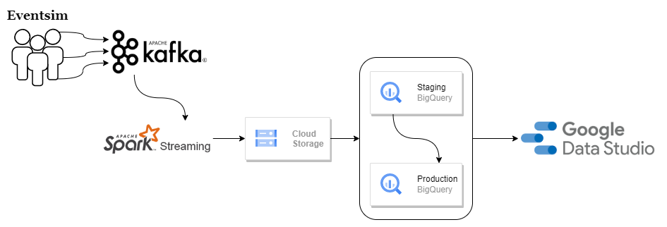
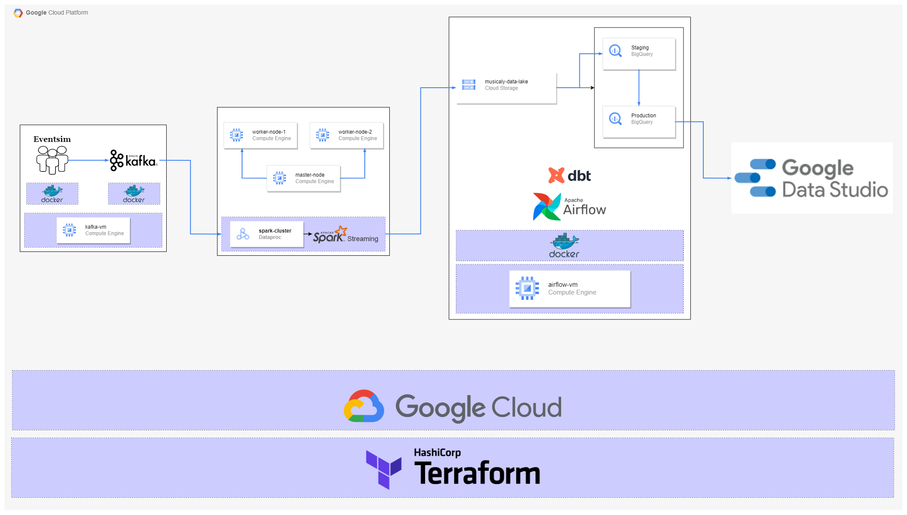
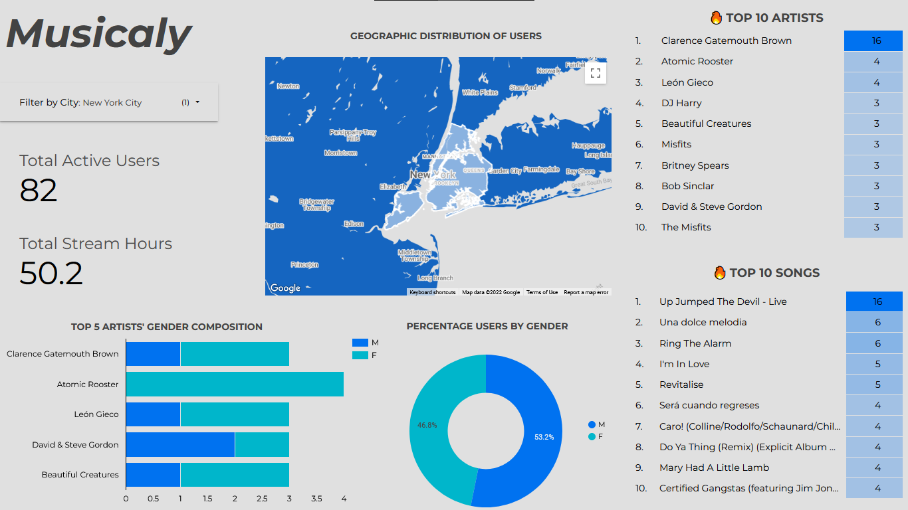

# musicaly

An end-to-end data pipeline that ingests simulated music stream data, structures, cleans and models the raw data, and perfroms analytics on clean data.

## background

Eventsim is a top music streaming company. The management of Eventsim are working on a new feature tailored to the preferences of the users. In order to aid the development of this feature, the user preferences needed to be understood certain things about the streaming habits of users. Hence, the management came up with use cases and questions that need to be answered.

1. What is the total number of active users, heir total stream hours and their geographic distribution?
2. What is the general gender composition of users and how do they make up the top artists?
3. What are the top songs and who are the top artists that users listen to?


## data flow

* Eventsim API produces the streaming data which are then consumed by Kafka.
* Stream data are read from Kafka with Spark Streaming.
* Spark Streaming structures the data and writes to data lake (Cloud Storage) as flat file.
* ELT from data lake (Cloud Storage) to data warehouse (BigQuery) using dbt, and orchestrated with Airflow
* Stream Analytics were performed and deployed using Google Data Studio.
  



## cloud architecture




## data source
Eventsim has an API where streaming data are produced in real time.

## dashboard

Click [here](https://datastudio.google.com/embed/reporting/1085eb37-b359-4613-90e2-71e54a82ff87/page/vYvuC) to view latest version on Data Studio




## how to setup
:warning: [**Note that GCP resources (which incur cost) are provisioned in this project**](https://cloud.google.com/pricing)

:warning: Also this setup assumes you are using a linux or bash environment

1. clone this repo to the `~/musicaly-project` directory

      ```bash
      git clone https://github.com/topefolorunso/musicaly-project.git ~/musicaly-project && \
      cd ~/musicaly-project
      ```
2. [setup GCP account](gcp/README.md)
3. [provision infrastructure](terraform/README.md)
4. start and ssh into the Kafka VM
   * set up VM
   * [start Eventsim](eventsim/README.md)

## how to run